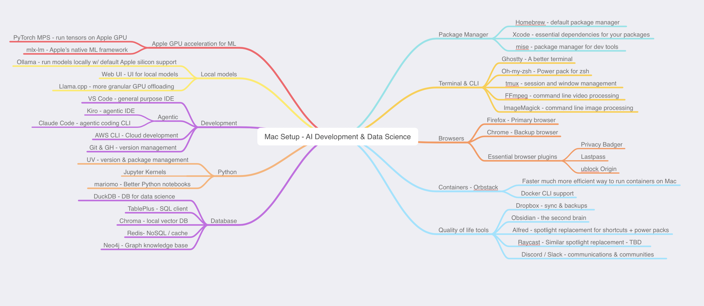

# Mac Setup for AI Development & Data Science


My macbook setup for AI and Data Science development in 2026. A lot has changed in AI development since I set up my last macbook pro, and all of the tools below are based on how my workflow as evolved. As such this is highly personal to my workflow and yours might be different.
## The Package Manager
### Homebrew
The Mac does not have a great official package and Homebrew is the first thing I have installed on a mac 
```
/bin/bash -c "$(curl -fsSL https://raw.githubusercontent.com/Homebrew/install/HEAD/install.sh)"
```

### Xcode
A lot of packages have additional dependencies so update xcode before anything else

```
xcode-select --install
```

### mise
Install and active mise - the package manager for your dev tools

```
brew install mise
echo 'eval "$(mise activate zsh)"' >> ~/.zshrc
source ~/.zshrc
```

## Terminal
### Ghostty
In 2025, I switched from iTerm to Ghostty. It's fast, lightweight and has everything I need without the distractions.
You can install it via the universal binary @ - https://ghostty.org/download or a community maintained package via homebrew
### Powerline Fonts
Optional, I like it for my CLI use
```
git clone https://github.com/powerline/fonts.git --depth=1
cd fonts
./install.sh
cd ..
rm -rf fonts
```
### Oh-my-zsh
I like the zsh shell and "oh-my-zsh" adds punch to it the base zsh shell 
```
sh -c "$(curl -fsSL https://raw.githubusercontent.com/ohmyzsh/ohmyzsh/master/tools/install.sh)"
```

Lookup the .zshrc in the .dotfiles for additional custom settings
### iTerm
While I don't actively use iterm, but I have it installed via the official binary and with the following default profile settings
```
Profiles -> Text -> Font `Melso LG S DZ Powerline` Regular 14
```

### tmux
Despite tabs and terminal splits, I still find myself using tmux, specially useful for running things in the background
```
brew install tmux
```

### ffmpeg
Command line video processing including things such as increasing video speed, adding images to videos and merging videos
```
brew install ffmpeg
```

### ImageMagick
Command line image processing, specially useful for image processing for ML training  
```
brew install imagemagick
```

## Browser
### Firefox
This is my default browser for most use cases and love the container support. Install via the official binary via - https://www.firefox.com/en-US/download/ or via homebrew 
```
brew install --cask firefox
```

### Chrome
For the times you still need chrome, you can get via the official site @  https://www.google.com/chrome/ or via homebrew 
```
brew install --cask google-chrome
```

### Browser Extensions
This can get bloated very quickly and I am trying to stick with the bare minimum here. These extension are compatible across the both the browsers
#### Password Manager
Lastpass - https://www.lastpass.com/
#### AdBlocker
ublock Origin lite - https://ublockorigin.com/
#### Privacy
Privacy Badger - https://privacybadger.org/


## Containers
I love docker, but docker on Mac is not the most efficient. **Orbstack** is a faster and a much more efficient way to run containers on Mac with support for Docker commands. Easy install via Homebrew
```
brew install orbstack
orb start
docker run --rm hello-world
```

## Mac Tools 
All optional, but these are make quality of life improvements for me on the Mac
### Dropbox
Something to backup and sync, by choice is dropbox but you can use what you like. Install via the the official dropbox site 
### Obsidian - The second brain 🧠
Completely optional and personal, but Obsidian is the one place I do everything. From notes to task/project management, wireframe diagrams, knowledge base and even my shopping list. Everything that is important, eventually goes in here. It's free , open source and does not have any proprietary format - just uses markdown. Install via here - https://obsidian.md/
#### Essential plugins
Obsidian is great out of the box, but these make my workflow bette
- Boards
- Mindmap
- Natural Language Dates
- Excalidraw
### Alfred 
I have been using Alfred over a decade now, it makes spotlight much better with handy shortcuts and power packs. Install via the official site here - https://www.alfredapp.com/
### Raycast
Similar spotlight replacement with additional features and AI. I am still trying this one out - https://www.raycast.com/
### Slack / Discord
Communities , messaging and 1:1 - https://slack.com/ or http://discord.com/
## Apple-silicon acceleration
### PyTorch MPS
PyTorch’s **MPS backend** lets you run on the Apple GPU by moving tensors/models to the `mps` device

Install in your project via `uv`
```
uv add torch torchvision torchaudio
```
Minimal MPS test:
```
uv run python - <<'PY'
import torch
print("mps available:", torch.backends.mps.is_available())
x = torch.randn(1024, 1024, device="mps")
print(x @ x.T)
PY
```

### mlm-mx
Apple’s native ML framework
## Local Models and UI

### Ollama
Install via homebrew 
```
brew install ollama
ollama --version
```
Run a model locally
```
ollama pull llama3.2
ollama run llama3.2
```
### WebUI
Sometimes you need a UI. Open WebUI supports Ollama and OpenAI-compatible APIs (so you can point it at local or remote model servers).
```
docker pull ghcr.io/open-webui/open-webui:main
docker run -d -p 3000:8080 \
  -v open-webui:/app/backend/data \
  --name open-webui \
  ghcr.io/open-webui/open-webui:main
```

### Llama.cpp
Ollama does most of this, but if you need more granular GPU offloading 
```
brew install llama.cpp
```
## Development
### General Purpose IDE
#### VS Code
Still using VS Code as the primary editor , install via the official site - https://code.visualstudio.com/download or Homebrew

```
brew install --cask visual-studio-code
```

#### VS Code Extensions
- Python (Microsoft)
- Jupyter (Microsoft)
- Remote SSH
- AWS (Amazon)
- MCP
### Agentic
#### Kiro
Kiro is my agentic AI IDE of choice with a generous free tier and the ability to switch between models. You can pick yours. I install mine from the offciall site here - https://kiro.dev/
##### Kiro Extensions
- Postman
- AWS
- MCP
#### Claude Code
In 2026, Claude code is still the leader IMO for CLI based agentic coding. There is homebrew option, but I go for the native install
```
curl -fsSL https://claude.ai/install.sh | bash
```


### Cloud Development
#### AWS Setup
Eventually you will run out of local resources and will need to scale to the cloud, and again in 2026 the leader here is still AWS with a very generous free tier. Install the AWS CLI and setup a default profile
```
curl "https://awscli.amazonaws.com/AWSCLIV2.pkg" -o "AWSCLIV2.pkg
sudo installer -pkg AWSCLIV2.pkg -target /
```

### Version Control
#### Git
Should be installed by default on the Mac, recommend to use the same
#### GitHub CLI
The default git on Mac works well with GitHub, the github cli adds the native github experience to your CLI
```
brew install gh
```

## Python
Another switch for 2025, I moved from PIP and Conda to `uv` for managing python environments and packages. I start by installing `uv` first and then use it to install and manage python versions and packages without messing up any of the global installs. 
```
brew install uv
uv python install
```

A typical project workflow looks something like this
```
mkdir myproj && cd myproj
uv init #will setup a venv environment
uv add httpx #add packages similar to pip
```

As a bonus, you can use `uv` to install other tools like ruff without polluting the global `pip`
```
uv tool install ruff@latest
```

### Jupyter Notebook & Kernels
Love them or hate them, you will need to work with these. My way of managing these is via the individual project environments and `uv` An example workflow below

```
mkdir myproj && cd myproj
uv init
uv run --with jupyter jupyter lab
```

### marimo - Notebooks, but better
If you like reactive notebooks and “git-friendly” workflows, I recently discovered marimo
```
uv tool install marimo
marimo tutorial
```


## Database
### DuckDB
A fast lightweight and good database alternative for data science. 
```
curl https://install.duckdb.org | sh
```

### TablePlus
A universal SQL client for the Mac - https://tableplus.com/download/
### Chroma
Local vector DB. Add via `uv` inside your projects
```
uv add chromadb
```
### Redis
NoSQL cache DB
```
brew install redis
```

### Neo4j
A knowledge base and graph DB. Install via homebrew
```
brew install neo4j
```